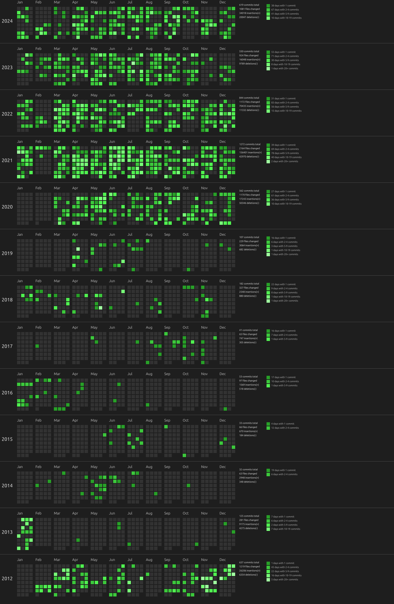

# commits-tilewall

A Rust application that generates a visual representation of commit activity across multiple Git repositories. This tool helps you visualize your contributions over time, making it easier to see patterns in your coding activity.

## License

This project is licensed under the MIT License

MIT License

Copyright (c) 2024 Shih-Yuan Lee (FourDollars)

Permission is hereby granted, free of charge, to any person obtaining a copy
of this software and associated documentation files (the "Software"), to deal
in the Software without restriction, including without limitation the rights
to use, copy, modify, merge, publish, distribute, sublicense, and/or sell
copies of the Software, and to permit persons to whom the Software is
furnished to do so, subject to the following conditions:

...

THE SOFTWARE IS PROVIDED "AS IS", WITHOUT WARRANTY OF ANY KIND, EXPRESS OR
IMPLIED, INCLUDING BUT NOT LIMITED TO THE WARRANTIES OF MERCHANTABILITY,
FITNESS FOR A PARTICULAR PURPOSE AND NONINFRINGEMENT. IN NO EVENT SHALL THE
AUTHORS OR COPYRIGHT HOLDERS BE LIABLE FOR ANY CLAIM, DAMAGES OR OTHER
LIABILITY, WHETHER IN AN ACTION OF CONTRACT, TORT OR OTHERWISE, ARISING FROM,
OUT OF OR IN CONNECTION WITH THE SOFTWARE OR THE USE OR OTHER DEALINGS IN THE
SOFTWARE.


## Features

- Collects commit data from specified Git repositories.
- Visualizes commit activity in a grid format, with each block representing a day.
- Customizable block size and spacing.
- Automatically detects and uses a system font for rendering.

## Installation

To use this application, ensure you have Rust and Cargo installed. Then, clone the repository and build the project:

```
Usage: commits-tilewall <author> <repo1> [repo2...] [--theme <theme>]
Available themes: light (default), dark, github
```

This image visually represents the commit activity of the specified author across multiple Git repositories over a defined period. Each block in the grid corresponds to a day, with the color intensity indicating the number of commits made on that day. The grid is organized by month and year, allowing for easy identification of periods of high activity. The background color and text are customizable based on the selected theme (light, dark, or GitHub), enhancing the visual appeal and readability of the data. The overall layout provides a clear and concise overview of the author's contributions over time, making it a valuable tool for tracking coding activity and patterns.


